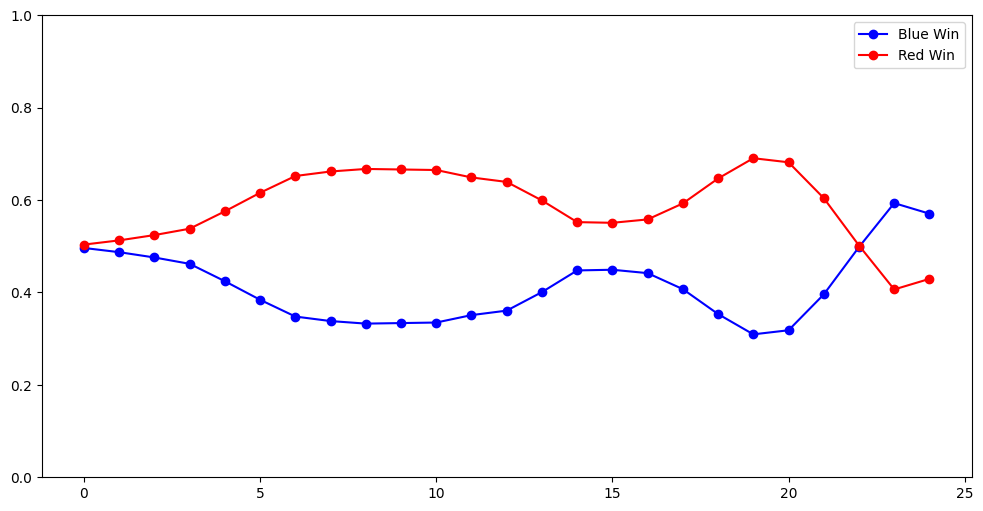
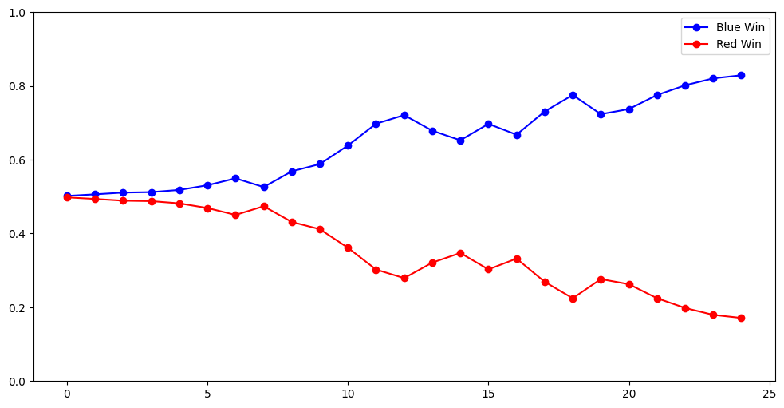
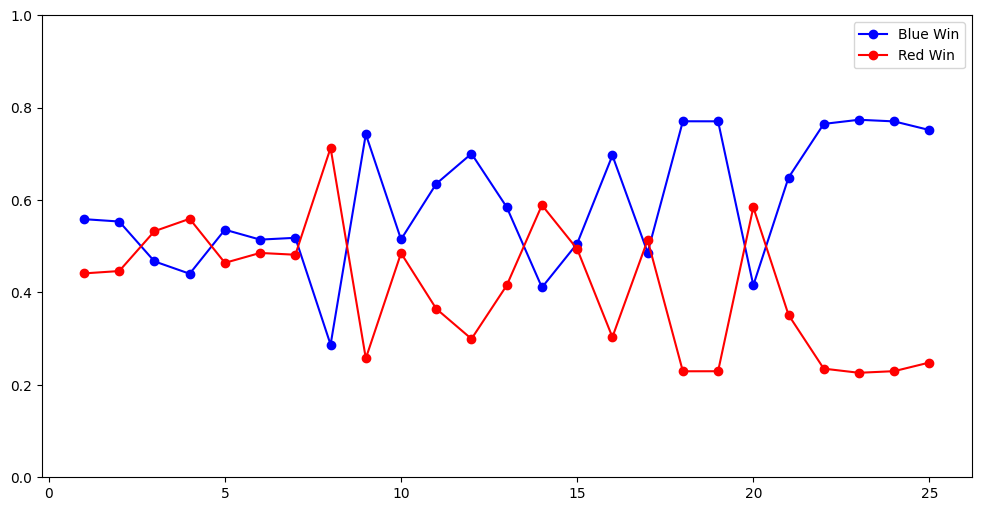
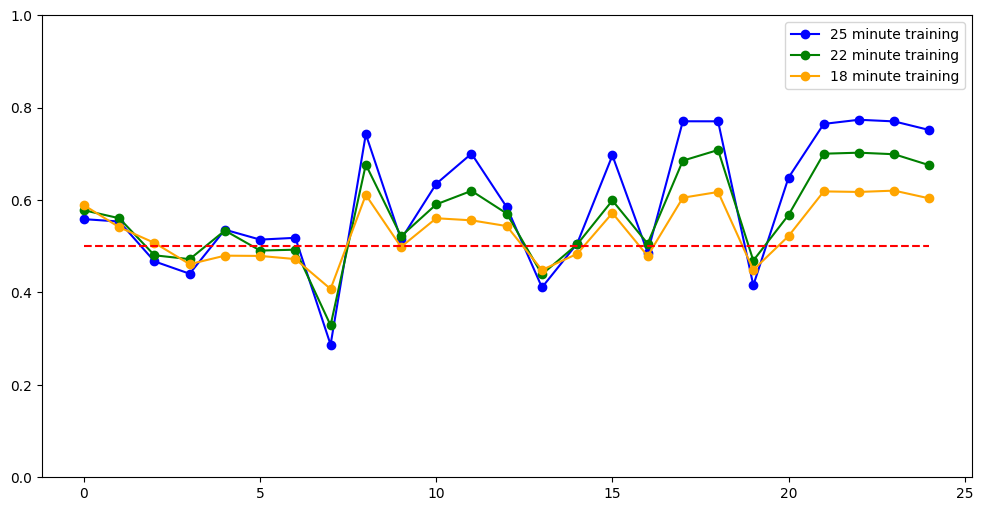
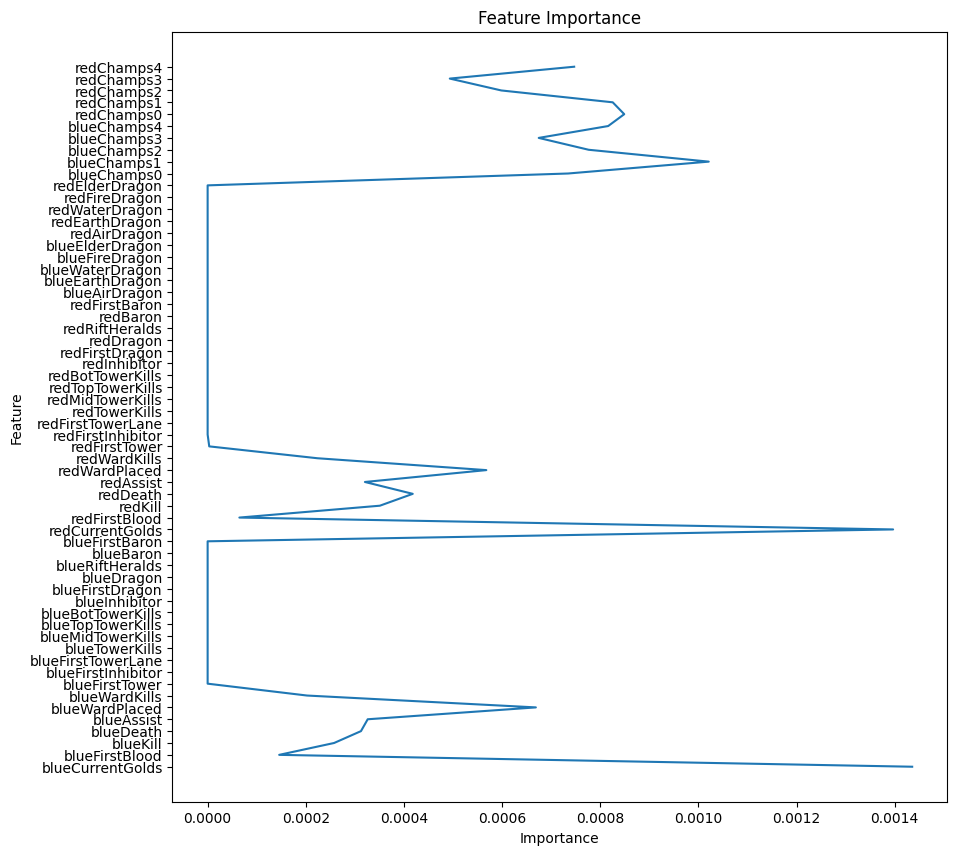
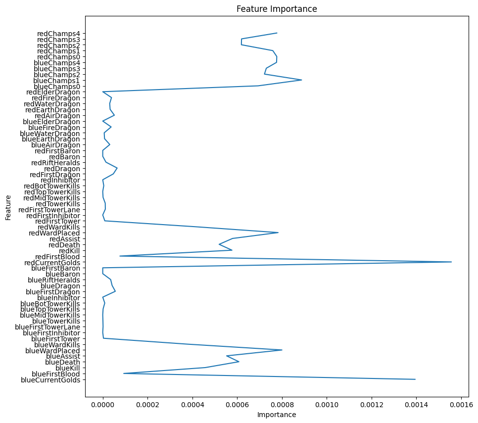
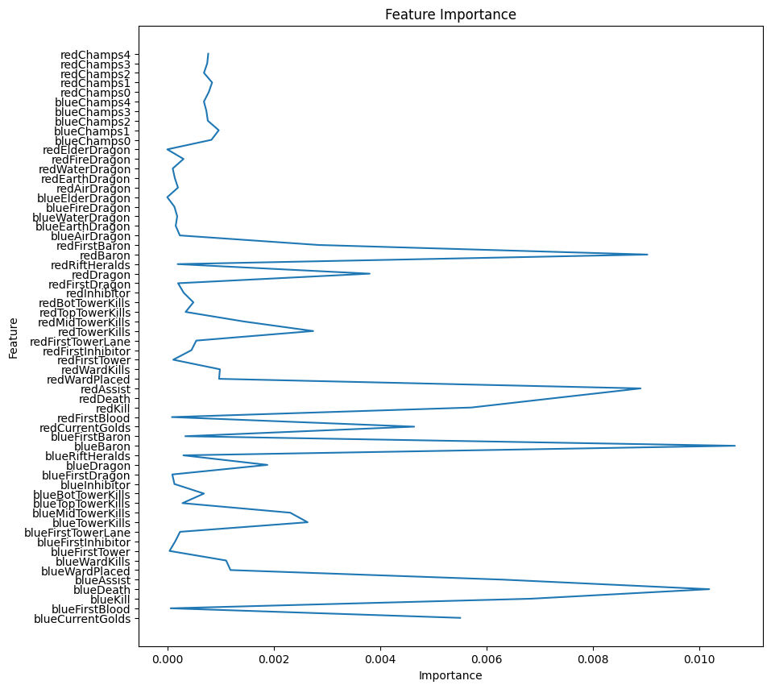

# **LOL**(League of Legend) 의 **승률 예측기**
## Contents
1. [Outline](#Outline)
2. [Description_DATA](#Description_DATA)
3. [Description_MODEL](#Description_MODEL)
4. [Summary](#Summary)
5. [Computing Environments](#Computing_Environments)
6. [References](#References)
## Outline
- 롤이라는 게임은 현재 국내외 시장 1위를 점령하고 있는 게임으로 [아시안 게임에서 종목이 선정](https://game.mk.co.kr/view.php?year=2021&no=1096343) 될 정도로 인기가 상당히 많은 게임 중 하나입니다. 그런데 이 게임 안에서는 매우 다양한 요소들이 승패에 영향을 끼치며 어느 정도의 지점까지는 어느 팀의 승리를 확신 할 수 없는 구간이 생기는 일이 대다수입니다. 그렇기에 이번 프로젝트에서는 다양한 요소들을 통해 승률이 얼마나 되는지 예측하는 프로그램을 만들게 되었습니다.
- 롤의 최종 목적은 적의 넥서스 타워를 부시면 승리하는 게임입니다. 그 중간과정에는 상대 팀의 챔피언을 킬(kill) 하거나 상대방의 넥서스 타워 전까지에 있는 타워를 부시거나 정글이라고 불리는 지역의 몹을 먹는 등 다양한 요소로 게임 내의 재화 요소인 골드(gold)를 수급하여 자신의 챔피언에 맞는 아이템을 사서 더 강해지며 승리에 가까워 지는 게임입니다.
- 이런 다양한 요소로 승패가 결정되는 가운데 이런 다양한 요소를 통합하여 직관적으로 어느 팀이 승리에 가까운지 나타내는 지표가 필요하다고 생각했습니다. 현재는 대표적인 지표로는 골드와 킬수 정도만 있기에 다른 부가적인 지표를 같이 넣을 수 있다면 좀 더 정확한 경기 관람이 될 수 있을 것 같습니다.
## Description_DATA
- 롤의 제작사 RIOT 에서는 게임의 내용을 살펴 볼 수 있는 API를 제공하고 있습니다 [링크](https://developer.riotgames.com/apis)
- 이번 모델에서 쓰이는 데이터는 롤의 랭크 게임 상위 유저의 게임을 약 10000게임 정도 받아와 분석을 하는 것입니다.
- API는 게임의 정보를 알기 위해서는 [상위 유저 닉네임](https://developer.riotgames.com/apis#league-v4)을 가져온 뒤[Summoner ID](https://developer.riotgames.com/apis#summoner-v4) 를 확보하고 summoner ID 를 통해 [puuid](https://developer.riotgames.com/apis#summoner-v4/GET_getBySummonerName) 를 가져온 뒤에 [Match ID](https://developer.riotgames.com/apis#match-v5) 를 puuid에 해당하는 유저의 최근 매치 100개까지 match ID 를 가져올 수 있습니다.
- API 사용시 1초에 최대 20개, 2분에 최대 100개의 데이터를 요청 할 수 있으며 API KEY 는 24시간 뒤 만료되기 때문에 재발급을 받아야 합니다.
    

    < Table 1 >
    

    |사용안 한 데이터| | | | |
    |---------------|----------------|--------------|----------------------|----------------------------|
    | blueTotalGolds| blueTotalLevel | blueAvgLevel | blueTotalMinionKills | blueTotalJungleMinionKills |
    | redTotalGolds | redAvgLevel | redTotalMinionKills | redTotalJungleMinionKills |
    
   

    < TABLE 2 >
    

    |사용한 데이터|||||
    |-----|-----|-----|-----|-----|
    | blueWins | blueCurrentGolds | blueFirstBlood | blueKill | blueDeath |
    | blueAssist | blueWardPlaced | blueWardKills | blueFirstTower | blueFirstInhibitor | 
    |blueFirstTowerLane | blueTowerKills | blueMidTowerKills | blueTopTowerKills | blueBotTowerKills | 
    |blueInhibitor | blueFirstDragon | blueDragon | blueRiftHeralds | blueBaron | 
    |blueFirstBaron | redCurrentGolds | redTotalLevel | redFirstBlood | redKill | 
    |redDeath | redAssist | redWardPlaced | redWardKills | redFirstTower |
    | redFirstInhibitor | redFirstTowerLane | redTowerKills | redMidTowerKills | redTopTowerKills |
    | redBotTowerKills | redInhibitor | redFirstDragon | redDragon | redRiftHeralds |
    | redBaron | redFirstBaron | blueAirDragon | blueEarthDragon | blueWaterDragon |
    | blueFireDragon | blueElderDragon | redAirDragon | redEarthDragon | redWaterDragon |
    | redFireDragon | redElderDragon | blueChamps0 | blueChamps1 | blueChamps2 |
    | blueChamps3 | blueChamps4 | redChamps0 | redChamps1 | redChamps2 |
    | redChamps3 | redChamps4 |
    
    - TABLE 1 의 데이터는 RIOT API에서 제공 받을 수 있으나 학습에서 제외시킨 데이터입니다.
    - TABLE 2 에서 Current Gold에 해당하는 값은 누적된 골드량이 아닌 아이템을 사고 남은 골드의 합입니다.

- 이번 프로젝트 진행 중 제일 크게 와닿은 것은 데이터의 퀄리티였습니다. 시계열 모델에서 미래를 알 수 있는 값을 주는 데이터는 모델에게 있어서 매우 치명적이였고 모델은 현재값에 집중 하는 것이 아닌 미래값에만 집중하게되어 모든 시간대에서 비슷한 예측값만 나오게 되는 현상이 있었습니다. 그렇기에 많은 데이터가 있었지만 사용 가능한 데이터만 넣으면서 모델 성능 향상에 집중했습니다. 

## Description_MODEL
### LSTM
- 처음으로 사용한 모델은 LSTM 으로 시계열 데이터에 최적화된 모델입니다.
이 모델에서는 7579 매치업 중 25분을 학습 시켰고, 테스트로 1895개의 게임으로 테스트를 진행했습니다. 

    

    < TABLE 3 >
    

    |  Torch     | 0 | 1|  accuracy  |  macro avg | weighted avg|
    |-------|---|---|------------|-----------|-------------|
    |precision|0.76|0.76|0.76|0.76|0.76|
    |recall|0.77|0.74|0.76|0.76|0.76|
    |f1-score|0.77|0.75|0.76|0.76|0.76|
    |support|964|931|0.76|1895|1895|

- 이번 lstm 모델에서는 은닉층의 개수에 대해서 많이 영향을 받았습니다. 위에서 나타난 결과값은 1536개의 은닉층이였습니다. 은닉층의 개수를 늘릴 때마다 성능이 계속 소폭 향상이 되었었고, 제 컴퓨터에서 2048개에서는 컴퓨터의 물리적 한계로 인해 오류가 뜨며 실패했습니다.
    - (torch.cuda.OutOfMemoryError: CUDA out of memory. Tried to allocate 6.20 GiB. GPU 0 has a total capacty of 12.00 GiB of which 0 bytes is free. Of the allocated memory 12.12 GiB is allocated by PyTorch, and 3.18 GiB is reserved by PyTorch but unallocated. If reserved but unallocated memory is large try setting max_split_size_mb to avoid fragmentation.  See documentation for Memory Management and PYTORCH_CUDA_ALLOC_CONF)

- 이 과정을 토대로 저는 시간대별 승률에 대해서 관측해봤습니다.

    대부분의 경기에서는 아래와 같이 시작 할 때는 50:50 에 가까웠습니다.
    이 경기에서는 레드팀이 초중반 우위를 점하다가 23분쯤에 어떤 사건이 있어 경기 양상이 크게 뒤짚힌 것을 확인 할 수 있습니다. 이번 데이터 수집에서 데이터 일관성을 위해 모든 경기를 25분으로 한정 시켰었기 때문에 확인이 안됐습니다.

    
    두번째로 이 경기에서는 계속 벌어진 차이로 인해 승패의 확신이 어느정도 가능해지고 초반의 차이를 복구 못 한 모습이 있습니다.

    
    세번째 경기로 이 경기에서는 특별한 지점이 있는데 바로 시작부분에서의 확률 차이입니다. 대부분의 환경에서는 50:50에 근접하게 나뉘었었지만 이 경기에서는 초반 성능지표가 꽤 납니다. 여기서 알 수 있는 지표는 아래에 기술이 되어있지만 처음에 가장 영향 받는 항목 중 하나는 유저가 쓰는 챔피언의 종류 입니다. 챔피언는 각각 제일 강한 타이밍이 다르게 되어있으며 이에 따라 초반 지표에서 확률이 차이나는 것으로 보입니다. 하지만 이런 처음 확률은 개발사가 하는 패치 내역에 따라 바뀌는 성능 지표가 매우 다르므로 더 좋은 프로그램이 되기 위해서는 지속적인 데이터 학습이 필요합니다.

    
    마지막으로 보이는 데이터는 LSTM의 장점을 제일 잘 활용한 예라고 볼 수 있습니다. LSTM은 과거의 학습 내용으로 미래를 예측 할 수 있는 능력을 가지고 있다는 것입니다.  이 데이터는 데이터 학습을 최대 25분에서 최소 18분으로 한 것이고, 25분까지의 데이터로 예측한 것입니다. 이 때 나타난 특징으로는 학습을 덜 시킬수록 대부분의 시간대에서 0.5 로 가까워지면서 이기나 지나 사람이 그냥 찍듯이 하는 확률에 가까워지는 것을 볼 수 있습니다.
- 이 데이터 분석에서 아쉬웠던 점은 실제 경기가 이뤄지는 것을 확인하면서 변화를 관측할 수 없기 때문에 왜 지표의 변화가 생기는지 확인 할 수 없었습니다. 작성일 기준으로는 RIOT 에서 실시간 매치 분당 정보를 지원해주고 있지 않기 때문에 지원하게 된다면 업데이트 해보도록 하겠습니다.
### CNN-LSTM
- 두번째로 LSTM 성능 향상을 위해 CNN 모델과 결합한 CNN-LSTM 혼합모델로 성능 테스트를 해봤습니다. 

    

    < TABLE 4 >
    

    | hidden_dim = 1536|precision|    recall|  f1-score  | support|
    |-|-|-|-|-|        
    |RedWin|       0.81 |     0.81|      0.81|   964 |        
    |BlueWin |      0.80 |     0.81 |     0.81     |  931|
    |accuracy |        |                  |0.81      |1895|  
    |macro avg |      0.81 |     0.81  |    0.81 |     1895|
   | weighted avg |     0.81     | 0.81     | 0.81|      1895|

    

    < TABLE 5 >
    

   | hidden_dim = 1024|precision|    recall|  f1-score  | support|
    |-|-|-|-|-|        
    |RedWin|       0.81 |     0.82|      0.81|   964 |        
    |BlueWin |      0.81 |     0.80 |     0.80     |  931|
    |accuracy |        |                  |0.81      |1895|  
    |macro avg |      0.81 |     0.81  |    0.81 |     1895|
   | weighted avg |     0.81     | 0.81     | 0.81|      1895|

    이번 테스트에서는 성능향상에 초점을 뒀습니다. TABLE 4, TABLE 5 는 모두 CNN-LSTM 테스트 테이블이고 은닉층에 대해서만 차이를 주고 그대로 테스트했습니다. 둘 다 모두 LSTM 모델보다 좀 더 좋은 성능을 보여줬으며, 은닉층이 작은 모델은 큰 모델과 비슷한 성능을 가지면서, 계산량이 더 적기에 훨씬 효율적인 모습을 보여줬습니다.( 은닉층 1536 일 때 걸린 시간 : 9분 12초, 은닉층 1024일 때 걸린 시간 2분 1초) 
### RandomForestClassiFier

- 세번째로 RandomForestClassiFier 로 학습 시켜서 테스트 해봤습니다. 학습시킨 데이터의 shape 은 (7579,25,60) 이였기에 모델이 학습할 수 있도록 (7579,1500) 으로 변경하여 학습시켜 테스트를 진행했습니다.  

    

    < TABLE 6 >
    

    |   |precision|recall|f1-score|support|
    |---|---------|------|--------|-------|
    |Red win| 0.92  | 0.93|0.93| 964|
    |Blue win   |0.93   |   0.92  |    0.92   |    931|
    |accuracy |    |    | 0.92  |    1895|
    | macro avg |      0.92 |     0.92 |     0.92 |     1895|
    |weighted avg     |  0.92     | 0.92    |  0.92     | 1895|

- 성능은 lstm으로 학습 시킨 것보다 좀 더 준수한 성능을 가지고 있으나 RandomForestClassiFier는 시계열 데이터의 시간적 특성을 고려하지는 않습니다. 그렇기에 이 모델은 순수 데이터 분석용으로 사용된 것입니다.

- 이 모델로 얻은 결과는 다음과 같습니다.
- 아래 자료는 Feature Importance를 얻기 위해 25 X 60 되어 있던 값들을 다시 60개의 특성으로 변경하여 반영한 자료입니다.

    - 이 자료는 초반 0-10의 시간대에서 Feature Importance으로 초반 특성을 반영하고 있습니다. 초반에는 유저가 사용하는 챔피언의 성능에 영향을 많이 받고 있고 초반에 돈을 모을 수 있는 상대 챔피언 킬에 따른 현재 골드를 가지고 있는 골드의 양에 따라 승률이 달라집니다. 또한 아직 용이나 바론과 같은 오브젝트를 먹을 수 없고, 타워를 부시기에도 적은 시간이기에 Feature Importance가 0으로 되어 있는 것을 확인 할 수 있습니다.
    
        
    - 두 번째 자료는 10-20 구간에서의 자료입니다. 초반 자료와 다르게 챔피언 선택에 따른 중요도는 떨어지고 골드의 차이와 타워와 드래곤 킬과 같은 다른 특성들이 반영되었습니다.

    
    - 세 번째 자료는 20-25 구간에서의 자료입니다. 이제는 챔피언의 중요도는 매우 떨어지게 되고 20분에 바론이 생성됨에 따라 바론을 먹었는지의 유무에 중요도가 달라지게 된 모습을 확인 할 수가 있습니다. 또한 누적된 킬과 데스가 이 지점에서 스노우볼이 커지게 되어 매우 중요한 지표로 바뀌게 되었습니다.

## Summary
- 이번 프로젝트는 최근 진행되었던 롤드컵과 같은 경기에서 좋은 지표로 활용 될 수 있다고 생각합니다. 또한 이런 지표를 통해 쉽지 않은 게임인 롤에 대해서 모르는 사람도 객관적인 지표를 통해 좀 더 쉽게 접근 할 수 있을 것으로 예상됩니다. 
- 또한 이번 자료에서 제일 재미있었던 부분은 ward 에 관한 내용이였습니다. 와드가 하는 역할은 롤에서 맵의 시야를 밝혀 적의 위치를 판단할 수 있는 방법이 되는데 이 부분은 gold 수급에 직접적인 영향을 주지 않고, 단지 상대의 위치를 통한 킬의 가능성만 높여주는 것입니다. 하지만 후반 지표를 통해 챔피언의 성능보다 와드를 더 많이 설치하거나 제거하는 것이 더 중요해지는 부분에서 와드의 중요성을 살필 수 있게 되었습니다.
- 프로젝트 내에서 아쉬웠던 점은 LSTM 모델 보다 RandomForestClassifier 모델이 성능이 더 좋게 나온 것이었습니다. 물론 LSTM도 더 발전 가능성이 있고, 미래를 예측하는 기능이 있다는 점에서 큰 이점이 있으나 성능의 차이는 조금 아쉬웠습니다. 하지만 사용한 데이터 Feature 들 말고도 사용할 수 있는 지표들은 더 여러가지가 있습니다. 게임에 참가한 유저들의 과거 전적에 따른 지표나, 선택한 챔피언들의 구체적인 지표를 반영하게 된다면 더 성능이 좋은 모델을 이끌어 낼 수 있을 것입니다.

## Computing_Environments
- cpu : Ryzen 5600x
- gpu : Geforce RTX 3060(12G)
- os : window 11
- cuda version : 11.8
- cuDNN version : 8.7.0

## References
- [Riot Devleoper 공식 문서](https://developer.riotgames.com/docs/lol)
- [Predicting Winning Rates of LOL in Real-time using Deep Learning](https://koreascience.kr/article/CFKO201924664106356.page)
- [Predicting Win-Loss of League of Legends Using Bidirectional LSTM Embedding](https://scienceon.kisti.re.kr/commons/util/originalView.do?cn=JAKO202012764215291&oCn=JAKO202012764215291&dbt=JAKO&journal=NJOU00550286)
- [기계학습을 활용한 게임승패 예측 및 변수중요도 산출을 통한 전략방향 도출](https://www.dbpia.co.kr/journal/articleDetail?nodeId=NODE10599646)